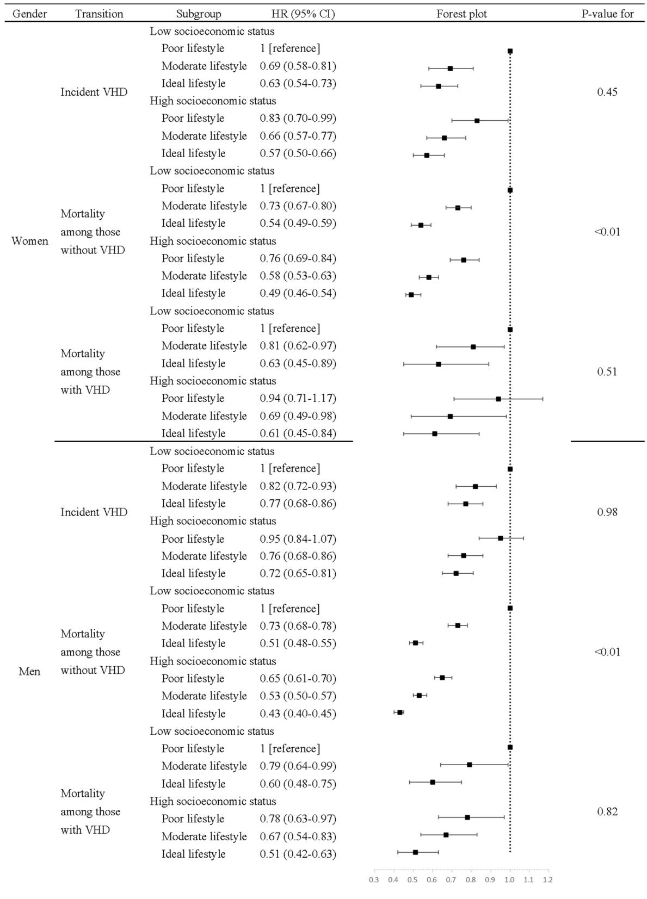
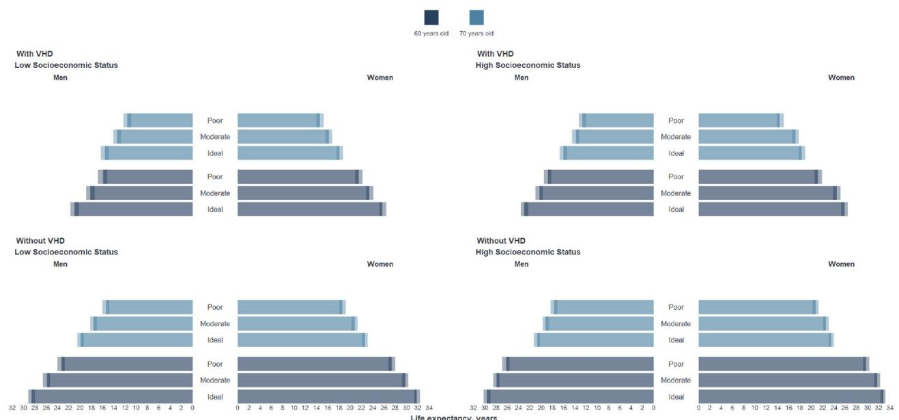

# RESEARCH ARTICLE

# Open Access

# Association of lifestyle with valvular heart disease progression and life expectancy among elderly people from diferent socioeconomic backgrounds

Yanxia Wei1,2,3, Dawei Sun4 , Sanjay Jaiswal1,2,3, Yuxin He1,2,3, Xianbao Liu1,2,3* and Jian’an Wang1,2,3*

# Abstract

Background Current cardiovascular prevention strategies are based on studies that seldom include valvular heart disease (VHD). The role of modifable lifestyle factors on VHD progression and life expectancy among the elderly with diferent socioeconomic statuses (SES) remains unknown.

Methods This cohort study included 164,775 UK Biobank participants aged 60 years and older. Lifestyle was determined using a fve-factor scoring system covering smoking status, obesity, physical activity, diet, and sleep patterns. Based on this score, participants were then classifed into “poor,” “moderate,” or “ideal” lifestyle groups. SES was classifed as high or low based on the Townsend Deprivation Index. The association of lifestyle with major VHD progression was evaluated using a multistate mode. The life table method was employed to determine life expectancy with VHD and without VHD.

Results The UK Biobank documented 5132 incident VHD cases with a mean follow-up of 12.3 years and 1418 deaths following VHD with a mean follow-up of 6.0 years. Compared to those with a poor lifestyle, women and men followed an ideal lifestyle had lower hazard ratios for incident VHD (0.66 with $9 5 \%$ CI, 0.59–0.73 for women and 0.77 with $9 5 \%$ CI, 0.71–0.83 for men) and for post-VHD mortality (0.58 for women, 95% CI 0.46–0.74 and 0.62 for men, $9 5 \%  C \lvert 0 . 5 4 -$ 0.73). When lifestyle and SES were combined, the lower risk of incident VHD and mortality were observed among participants with an ideal lifestyle and high SES compared to participants with an unhealthy lifestyle and low SES. There was no signifcant interaction between lifestyle and SES in their correlation with the incidence and subsequent mortality of VHD. Among low SES populations, 60-year-old women and men with VHD who followed ideal lifestyles lived 4.2 years $9 5 \%$ CI, 3.8–4.7) and 5.1 years $9 5 \%$ CI, 4.5–5.6) longer, respectively, compared to those with poor lifestyles. In contrast, the life expectancy gain for those without VHD was 4.4 years $9 5 \%$ CI, 4.0–4.8) for women and 5.3 years $9 5 \%$ CI, 4.8–5.7) for men when adhering to an ideal lifestyle versus a poor one.

Conclusions Adopting a healthier lifestyle can signifcantly slow down the progression from free of VHD to incident VHD and further to death and increase life expectancy for both individuals with and without VHD within diverse socioeconomic elderly populations.

Keywords Valvular heart disease, Socioeconomic status, Lifestyle, Life expectancy, Multistate model

*Correspondence:

Xianbao Liu

liuxb@zju.edu.cn

Jian’an Wang

wangjianan111@zju.edu.cn

Full list of author information is available at the end of the article

# Background

Valvular heart disease (VHD) ranks as the third most frequent cardiovascular disease, after hypertension and coronary artery disease [1], with aortic valve stenosis and mitral regurgitation being the most common diagnoses [2]. Te prevalence of VHD rises sharply with age—it afects $5 { - } 1 0 \%$ of people aged 65–74  years and $1 0 { - } 2 0 \%$ of those over 75 [3]. However, these fgures might not fully capture the actual situation. In a UK study involving 2500 individuals over 65, $5 1 \%$ were found to have previously undiagnosed VHD, which was primarily mild in nature [4]. As the global population ages, VHD is likely to become the next cardiovascular pandemic. Nonetheless, most cardiovascular disease prevention studies have overlooked VHD [5–7], and there is currently no established preventive strategy that can decelerate the risk of VHD, particularly among the elderly.

A healthy lifestyle is one of the potential modifcations for VHD. Some studies have demonstrated that no current smoking [8], no obesity [9], healthy sleep patterns [10, 11], healthy dietary habits [12], and physical activity[13] are linked to a reduced risk of VHD. Tese lifestyle factors have been shown to be interrelated, and their combined efects lead to stronger associations with health outcomes [14]. And a recent study revealed that a comprehensive score of these healthy lifestyle factors is signifcantly linked to the occurrence of VHD [15]. However, those previous studies focused on only one disease stage and did not consider morbidity and mortality as a continuum in their analysis. Tus, it is imperative to bridge this gap by explore the role of a healthy lifestyle on the progression from health to the onset of VHD and subsequently to mortality.

An established association exists between socioeconomic status (SES) and an increased risk of cardiovascular disease [16]. Studies have also shown that lower SES is linked to a higher risk of developing aortic valve stenosis as well as its associated mortality [17, 18]. It is unclear whether a high lifestyle level can attenuate the risk of VHD associated with low socioeconomic level. Addressing only lifestyle factors while neglecting social determinants may lead to wider health disparities [19]. To ensure a fair distribution of healthcare resources, it is essential to better understand the role of lifestyle in populations with varying SES levels, especially those at higher risk.

Here, we took advantage of the UK Biobank cohort study to investigate the potential role of overall lifestyles on major VHD risk among older adults. In addition to presenting results through the widely used hazard ratios (HRs), we also adopted an easily understood metric of life expectancy, to provide comprehensive evidence support for health professionals and the general public to plan their future healthcare. Our objective was to assess

the role of healthy lifestyle on the progression from being free of VHD, transitioning to disease onset, and eventually advancing to mortality. Specifcally, we analyzed to what extent a healthy lifestyle correlates with longevity in people with and without VHD. Furthermore, we explored how these changes vary across diferent SES.

# Methods

# Study population

Te UK Biobank is a large-scale prospective cohort study with an open-access protocol [20]. Approximately 500,000 individuals aged 40–69  years were recruited from 22 assessment centers across England, Scotland, and Wales between 2006 and 2010. Baseline information on participants’ lifestyle, socioeconomic, and healthrelated factors were obtained through questionnaires, interviews, and physical measurements, while blood samples were also collected and processed. All participants provided written informed consent. Tis study was approved by the National Information Governance Board for Health and Social Care and the North West Multi-Center Research Ethics Committee. Our analysis was restricted to participants who were 60 years old and above. We excluded individuals with missing data on lifestyle factors, SES, or other covariates.

# Lifestyle factors

A lifestyle score was created based on 5 risk factors (tobacco smoking, obesity, physical inactivity, unhealthy diet, and unhealthy sleep patterns) measured by the UK Biobank questionnaire at baseline. We adopted three healthy lifestyle criteria based on the cardiovascular health promotion goals of the American Heart Association [21]: not smoking for over a year, maintaining a body mass index (BMI) below 30, and engaging in regular physical activity (at least $1 5 0 \ \mathrm { m i n }$ per week of moderate intensity, $7 5 \mathrm { \ m i n }$ per week of vigorous intensity, or a combination of moderate and vigorous activities totaling at least 150  min per week). A healthy diet was determined according to the 2021 dietary guidance for cardiovascular health from the AHA [22]. Since 6 of the 13 recommended dietary priorities were unavailable in the UK Biobank, a healthy diet pattern was identifed based on increased consumption of fruits, vegetables, whole grains, and fsh and decreased or no consumption of refned grains, processed meats, and unprocessed red meats. Additionally, a healthy sleep pattern was defned by the presence of at least four of the following characteristics: being an early riser, sleeping $^ { 7 - 8 \mathrm { ~ h ~ } }$ per day, seldom or never having insomnia symptoms, not snoring, and not experiencing excessive daytime sleepiness [23]. We assigned one point to each favorable lifestyle factor and categorized overall lifestyle into three levels: poor (zero

to two points), moderate (three points), and ideal (four to fve points). Table S1 in Additional fle 1 describes the lifestyle factors in greater detail.

# SES and covariates

Te Townsend Deprivation Index (TDI) was sourced from national census data within the UK Biobank, signifying an area-level socioeconomic status (SES) measure based on variables including car ownership, household overcrowding, owner occupation, and employment [24]. Te Townsend scores are a continuous variable, where higher values indicate a lower SES. Participants were divided into two groups, with those scoring above the 60th percentile defned as having low SES.

We also selected two individual-level measures of SES available within the UK Biobank: household income and educational qualifcations. Average household income information was self-reported, with low income defned as less than £31,000. Participants also disclosed their highest educational qualifcations, choosing from a list that included “College or university degree,” “A levels/ AS levels or equivalent,” “O levels/GCSEs or equivalent,” “CSEs or equivalent,” “NVQ or HND or HNC or equivalent,” “Other professional qualifcations,” “None of the above,” or “Prefer not to answer.” According to the International Standard Classifcation of Education [25], we categorized educational attainment into two levels: low, which included “O levels/GCSEs/CSEs or equivalent” and “None of the above,” and high, which encompassed “College or university degree,” “A levels/AS levels or equivalent,” “NVQ or HND or HNC or equivalent,” and “Other professional qualifcations.

Covariates including age, ethnicity, the medication use for cholesterol and blood pressure, and a history of hypertension, dyslipidemia, diabetes, coronary artery disease, atrial fbrillation, cardiomyopathy, heart failure, chronic kidney disease, and cancer were collected via a self-administered touchscreen questionnaire. Operative procedures for VHD were coded according to the Ofce of Population Censuses and Surveys Classifcation of Interventions and Procedures, version 4 (OPCS-4), using hospital inpatient records (K25, K26, K311, K312, K341, K351, K352).

# Outcomes

Te outcome was major VHD, defned as a composite of the two most common types in the UK Biobank: aortic stenosis and mitral regurgitation. We excluded congenital and rheumatic valve diseases. Incident cases of VHD were identifed through linkage with Hospital Episode Statistics (HES) and national death registries. For our analysis, we considered only the frst VHD event in compound cases, disregarding any subsequent events. Te

International Classifcation of Diseases 10th Revision (ICD 10) was used to code VHD cases. Vital status was obtained from Death Registries. Te date of each VHD event was pinpointed as the earliest recorded occurrence within the UK Biobank data. A detailed outcome defnition can be found in Table  S2 in Additional fle  1. Participants were followed-up in the database from their assessment date until July 31, 2021, for Scotland, October 31, 2022, for England, or February 28, 2018, for Wales.

# Statistical analysis

Participants of the UK Biobank were followed up from baseline until the date of diagnosis, death, withdrawal, or completion of follow-up, whichever came frst. To investigate the role of lifestyle on the progression of VHD, we employed a multistate model with a Gompertz distribution [26]. Tis model included three states: “NO-VHD,” “VHD,” and “death.” Tree transitions were observed in participants: (1) from no VHD to incidence of VHD, (2) from no VHD directly to death, and (3) from VHD diagnosis to death. We only considered the frst occurrence of transitioning into a new state and did not allow for reversal.

When analyzing transitions 1 and 2, participants who had prevalent VHD at the baseline were excluded. For transition 3, we included those with prevalent VHD at the baseline as well as those who developed VHD during follow-up. Te multistate survival analysis was controlled for covariates including age, ethnicity, histories of hypertension, dyslipidemia, and diabetes, as well as medication use for cholesterol and blood pressure. Age at diagnosis of VHD was further adjusted in the analysis of transition 3. We estimated hazard ratios (HRs) to measure the association of lifestyle alone, the combination of lifestyle and SES, and lifestyle within SES-stratifed subpopulations with VHD incidence and mortality. In addition, we calculated the dose–response relationship between lifestyle category and health outcomes, in which lifestyle category was treated as a continuous variable. To explore multiplicative interactions, a product term combining the socioeconomic and lifestyle scores was additionally included in our model.

We assessed the life expectancy of individuals with or without VHD categorized by lifestyle categories across SES levels. First, the Gompertz multistate model was employed, utilizing age from 60  years as the time scale, to determine the age-specifc and SES-specifc transition rates for each transition. Next, the baseline prevalence of lifestyle levels was calculated by every 10-year age bracket and by SES among participants without VHD at baseline and those with VHD during follow-up. Ten, we used SES-specifc hazard ratios by lifestyle, and the proportions of lifestyle categories, to weight transition

rates as described in previously published methods [27]. Finally, using the weighted age-specifc and SES-specifc transition rates, we constructed life tables for people with and without VHD [28, 29]. We assumed that individuals currently without VHD could develop the condition in the future. Our life tables concluded at 100 years, with methodological details provided in the supplemental method in Additional fle  1. Years of life gained due to healthier lifestyles was calculated by subtracting the life expectancies of participants with ideal and moderate lifestyles from those with a poor lifestyle of the same age and SES. Te $9 5 \%$ confdence interval for the life expectancy was estimated by conducting 2000 Monte Carlo simulations. To account for gender-specifc diferences in life expectancy, all analyses were conducted separately for men and women.

We confrmed the robustness of our analyses by performing sensitivity analyses in which (1) the continuous lifestyle score was considered rather than categorical variable; (2) the fve lifestyle factors were analyzed separately, instead of being aggregated into a single score; (3) additional adjustments were made for potential confounders in the lifestyle-VHD relationship, such as coronary artery disease, atrial fbrillation, cardiomyopathy, heart failure, chronic kidney disease, and cancer; (4) the Cardiovascular Health (CVH) metric, introduced by the American Heart Association (AHA), was used instead of lifestyle; (5) aortic stenosis and mitral regurgitation were considered separately, instead of being aggregated into a general VHD category; (6) low socioeconomic status was indicated by a TDI percentile above 40, rather than 60th percentile; (7) individual-level measures of SES, such as household income and educational attainment, were used; (8) participants who developed VHD or died within the frst 2  years of follow-up were excluded; (9) for the analysis of VHD patients (transition 3), we made additional adjustments to account for any operations related to VHD; (10) participants without VHD were assumed to be immune to the disease, and their expected lifetimes were recalculated.; (11) multiple imputation was conducted to impute all missing independent variables and test the infuence of missing data.

All statistical analyses were performed using the R software 4.0. All $P$ values were two-sided and considered statistically signifcant when less than 0.05.

# Results

# Cohort characteristics

Tere are a total of 164,775 participants with data available for analysis after excluding 115,688 participants due to missing data on lifestyle factors $( n = 1 1 5 , 2 1 5$ ) and the TDI $\scriptstyle ( n = 4 7 3$ ) as well as excluding 221,905 participants who were younger than 60 years old (Additional fle 1: Fig.

S1). Of the 164,775 participants in the fnal analysis, 997 reported VHD at baseline. Te mean follow-up period was 12.3 years (SD 2.7) for VHD incidence, 6.0 years (SD 4.3) for mortality among those with VHD, and 12.5 years (SD 2.5) for mortality among those without VHD. Over the follow-up period, 5132 incident events and 1418 VHD deaths, and 17 810 non-VHD deaths occurred.

Te baseline characteristics of eligible participants are outlined in Table 1. For the overall participants, the mean age was 64.1 years (SD 2.8), and $5 1 . 8 \%$ were female. Tere were 30,006 $( 1 8 . 2 \% )$ participants with a poor lifestyle, 46,119 $( 2 8 . 0 \% )$ ) with a moderate healthy lifestyle, and 88,650 $( 5 3 . 8 \% )$ who adopted an ideal lifestyle. A majority of UK Biobank participants met the healthy criteria for each lifestyle factor, with no current smoking having the highest adherence rate (over $9 0 \%$ ), while a smaller proportion achieved healthy diet standards $( 4 4 . 8 \%$ to $6 0 . 2 \%$ ) and healthy sleep patterns $5 5 . 5 \%$ to $5 8 . 9 \%$ ). Participants with a poor lifestyle exhibited a higher prevalence of low SES, household income, and educational attainment compared to those in the ideal lifestyle group.

# Incident valvular heart disease and mortality

Participants in both moderate and ideal healthy categories demonstrated lower HRs for all outcomes compared to those in the poor healthy category, regardless of gender. For women, individuals following an ideal lifestyle had a $3 4 \%$ and $4 2 \%$ lower rate for incident VHD and mortality from VHD, respectively, compared to those adhering to a poor lifestyle. For men, these fgures were $2 3 \%$ and $3 8 \%$ , respectively (Table 2). Comparable results were observed when we repeated the analysis using lifestyle scores as a substitute for lifestyle categories, after additional adjustment for coronary artery disease, atrial fbrillation, cardiomyopathy, heart failure, chronic kidney disease, and cancer and by using AHA’s cardiovascular health metrics. Analyses for each lifestyle component showed that, overall, fve factors contributed to lower risk of VHD events and mortality in both women and men (Additional fle  1: Table  S3-S4). When the analysis was carried out separately for aortic stenosis and mitral regurgitation, a similar pattern was observed, indicating that both better health outcomes of aortic stenosis and mitral regurgitation were signifcantly associated with healthier lifestyle levels (Additional fle 1: Tables S5).

When socioeconomic status and lifestyle categories were combined, a monotonic association was observed; participants with higher SES and healthier lifestyles had better health outcomes in VHD. Tose with high SES and an ideal lifestyle had a lower risk of incident VHD and mortality than their counterparts with low SES and a poor lifestyle. Tere was no signifcant interaction between lifestyle level and SES in terms of VHD

Table 1 Baseline characteristics by lifestyle level   

<table><tr><td rowspan="3">Characteristicsa</td><td colspan="4">Women</td><td colspan="4">Men</td></tr><tr><td colspan="4">Lifestyle levelb</td><td colspan="4">Lifestyle levelb</td></tr><tr><td>Poor (N=13 221)</td><td>Moderate (N=22 369)</td><td>Ideal (N=49 821)</td><td>All (N=85 411)</td><td>Poor (N=16 785)</td><td>Moderate (N=23 750)</td><td>Ideal (N=38 829)</td><td>All (N=79 364)</td></tr><tr><td>Age (years)</td><td>63.9±2.83</td><td>64.0±2.83</td><td>64.0±2.83</td><td>64.0±2.83</td><td>64.0±2.82</td><td>64.2±2.85</td><td>64.3±2.86</td><td>64.2±2.85</td></tr><tr><td>White ethnicity</td><td>12 902 (97.59)</td><td>21 735 (97.17)</td><td>48 454 (97.26)</td><td>83 091 (97.28)</td><td>16 381 (97.59)</td><td>23 077 (97.17)</td><td>37 610 (96.86)</td><td>77 068 (97.11)</td></tr><tr><td>SES categoryc</td><td></td><td></td><td></td><td></td><td></td><td></td><td></td><td></td></tr><tr><td>Low</td><td>6424 (48.60)</td><td>9355 (41.82)</td><td>18 712 (37.56)</td><td>34 493 (40.38)</td><td>7886 (47.0)</td><td>9631 (40.6)</td><td>14 015 (36.1)</td><td>31 532 (39.7)</td></tr><tr><td>High</td><td>6795 (51.40)</td><td>13 014 (58.18)</td><td>31 109 (62.44)</td><td>50 918 (59.62)</td><td>8899 (53.0)</td><td>14 119 (59.4)</td><td>24 814 (63.9)</td><td>47 832 (60.3)</td></tr><tr><td>Household incomed</td><td></td><td></td><td></td><td></td><td></td><td></td><td></td><td></td></tr><tr><td>Low</td><td>7986 (60.40)</td><td>12 694 (56.75)</td><td>26 512 (53.21)</td><td>47 192 (55.25)</td><td>9701 (57.80)</td><td>12 833 (54.0)</td><td>19 672 (50.66)</td><td>42 206 (53.18)</td></tr><tr><td>High</td><td>2358 (17.84)</td><td>4729 (21.14)</td><td>12 367 (24.82)</td><td>19 454 (22.78)</td><td>5089 (30.32)</td><td>8110 (34.15)</td><td>14 750 (37.99)</td><td>27 949 (35.22)</td></tr><tr><td>Missing data</td><td>2877 (21.76)</td><td>4946 (22.11)</td><td>10 942 (21.96)</td><td>18 765 (21.97)</td><td>1995 (11.893)</td><td>2807 (11.82)</td><td>4407 (11.35)</td><td>9209 (11.60)</td></tr><tr><td>Education attainmente</td><td></td><td></td><td></td><td></td><td></td><td></td><td></td><td></td></tr><tr><td>Low</td><td>7288 (55.12)</td><td>10 912 (48.78)</td><td>20 870 (41.89)</td><td>39 070 (45.74)</td><td>7282 (43.38)</td><td>9007 (37.92)</td><td>12 188 (31.39)</td><td>28 477 (35.88)</td></tr><tr><td>High</td><td>5775 (43.68)</td><td>11 189 (50.02)</td><td>28 346 (56.90)</td><td>45 310 (53.05)</td><td>9303 (55.42)</td><td>14 442 (60.81)</td><td>26 182 (67.43)</td><td>49 927 (62.91)</td></tr><tr><td>Missing data</td><td>158 (1.20)</td><td>268 (1.20)</td><td>605 (1.21)</td><td>1031 (1.21)</td><td>200 (1.19)</td><td>301 (1.27)</td><td>459 (1.18)</td><td>960 (1.21)</td></tr><tr><td>Healthy lifestyle factors</td><td></td><td></td><td></td><td></td><td></td><td></td><td></td><td></td></tr><tr><td>No current smoking</td><td>10 391 (78.59)</td><td>20 616 (92.16)</td><td>49 039 (98.43)</td><td>80 046 (93.72)</td><td>12 305 (73.31)</td><td>21 355 (89.92)</td><td>38 113 (98.16)</td><td>71 773 (90.44)</td></tr><tr><td>No obesity</td><td>4542 (34.35)</td><td>14 674 (65.60)</td><td>45 925 (92.18)</td><td>65 141 (76.27)</td><td>6403 (38.15)</td><td>16 815 (70.80)</td><td>36 114 (93.01)</td><td>59 332 (74.76)</td></tr><tr><td>Regular physical activity</td><td>3980 (30.10)</td><td>13 680 (61.16)</td><td>44 697 (89.72)</td><td>62 357 (73.01)</td><td>5907 (35.19)</td><td>16 416 (69.12)</td><td>35 710 (91.97)</td><td>58 033 (73.12)</td></tr><tr><td>Healthy diet</td><td>2324 (17.58)</td><td>9207 (41.16)</td><td>39 919 (80.12)</td><td>51 449 (60.24)</td><td>1714 (10.21)</td><td>6509 (27.41)</td><td>27 352 (70.44)</td><td>35 575 (44.83)</td></tr><tr><td>Healthy sleep pattern</td><td>2178 (16.47)</td><td>9831 (39.93)</td><td>39 189 (78.66)</td><td>50 298 (58.89)</td><td>2845 (16.95)</td><td>10 155 (42.76)</td><td>31 042 (79.95)</td><td>44 042 (55.49)</td></tr><tr><td>History of disease</td><td></td><td></td><td></td><td></td><td></td><td></td><td></td><td></td></tr><tr><td>Hypertension</td><td>5718 (43.25)</td><td>7832 (35.01)</td><td>13 546 (27.19)</td><td>27 096 (31.72)</td><td>8185 (48.76)</td><td>9640 (40.59)</td><td>12 966 (33.39)</td><td>30 791 (38.80)</td></tr><tr><td>Dyslipidemia</td><td>2805 (21.22)</td><td>3848 (17.20)</td><td>6912 (13.87)</td><td>13,565 (15.88)</td><td>4439 (26.45)</td><td>5493 (23.13)</td><td>7589 (19.54)</td><td>17 521 (22.08)</td></tr><tr><td>Diabetes</td><td>1033 (7.81)</td><td>1073 (4.80)</td><td>1197 (2.40)</td><td>3303 (3.87)</td><td>2128 (12.68)</td><td>1986 (8.36)</td><td>2010 (5.18)</td><td>6124 (7.72)</td></tr><tr><td>Coronary artery disease</td><td>935 (7.07)</td><td>1008 (4.51)</td><td>1546 (3.10)</td><td>3489 (4.08)</td><td>2578 (15.36)</td><td>2756 (11.60)</td><td>3713 (9.56)</td><td>9047 (11.40)</td></tr><tr><td>Atrial fibrillation</td><td>119 (0.90)</td><td>170 (0.76)</td><td>323 (0.65)</td><td>612 (0.72)</td><td>301 (1.79)</td><td>388 (1.63)</td><td>619 (1.59)</td><td>1308 (1.65)</td></tr><tr><td>Heart failure</td><td>22 (0.17)</td><td>10 (0.04)</td><td>15 (0.03)</td><td>47 (0.06)</td><td>26 (0.15)</td><td>24 (0.10)</td><td>30 (0.08)</td><td>80 (0.10)</td></tr><tr><td>Cardiomyopathy</td><td>13 (0.10)</td><td>15 (0.07)</td><td>19 (0.04)</td><td>47 (0.06)</td><td>23 (0.14)</td><td>23 (0.10)</td><td>34 (0.09)</td><td>80 (0.10)</td></tr><tr><td>Chronic kidney disease</td><td>9 (0.07)</td><td>21 (0.09)</td><td>17 (0.03)</td><td>47 (0.06)</td><td>20 (0.12)</td><td>22 (0.09)</td><td>13 (0.03)</td><td>55 (0.07)</td></tr><tr><td>Cancer</td><td>1911 (14.45)</td><td>3112 (13.91)</td><td>6774 (13.60)</td><td>11,797 (13.81)</td><td>1768 (10.53)</td><td>2493 (10.50)</td><td>3893 (10.03)</td><td>8154 (10.27)</td></tr><tr><td>Lip lower medication</td><td>3935 (29.76)</td><td>5189 (23.20)</td><td>8595 (17.25)</td><td>17 719 (20.75)</td><td>7144 (42.56)</td><td>8547 (35.99)</td><td>11 618 (29.92)</td><td>27 309 (34.41)</td></tr><tr><td>Anti-hypertension medication</td><td>4973 (37.61)</td><td>6668 (29.81)</td><td>11 066 (22.21)</td><td>22 707 (26.59)</td><td>7675 (45.73)</td><td>8827 (37.17)</td><td>11 777 (30.33)</td><td>28 279 (35.63)</td></tr><tr><td>Age at diagnosis of VHDf</td><td>71.5±5.17</td><td>72.0±5.00</td><td>71.9±5.05</td><td>71.8±5.07</td><td>71.2±5.11</td><td>71.4±5.02</td><td>71.6±5.12</td><td>71.4±5.09</td></tr><tr><td>Operation for VHDf</td><td>127 (23.39)</td><td>161 (24.88)</td><td>332 (27.74)</td><td>620 (25.97)</td><td>306 (30.51)</td><td>367 (33.09)</td><td>565 (34.66)</td><td>1238 (33.08)</td></tr></table>

SES socioeconomic status, VHD valvular heart disease   
a Data were mean $\pm$ standard deviation or count (percentage) for continuous and categorical variables   
b Lifestyle level was determined as poor (meeting zero to two Healthy lifestyle factors), moderate (meeting three factors), and ideal (meeting four to fve factors)   
c Low socioeconomic status referred to individuals above the 60th percentile on the Townsend Deprivation Index   
d Low household income was classifed as less than £31,000 family income levels   
e Low education was defned as an individual who has attained a level of equal to or lower than levels/GCSEs/CSEs or equivalent   
f Age at diagnosis of VHD and whether an operation for VHD was performed were measured in participants with prevalent VHD at baseline and those who developed incident VHD during follow-up

Table 2 Incident VHD and death by lifestyle level   

<table><tr><td rowspan="2">Gender</td><td rowspan="2">Transition</td><td colspan="2">Poor \(lifestyle^a\)</td><td colspan="2">Moderate \(lifestyle^a\)</td><td colspan="2">Ideal \(lifestyle^a\)</td><td rowspan="2">HR for trend (95% CI)</td></tr><tr><td>No. of cases/person-years</td><td>HR (95% CI)</td><td>No. of cases/person-years</td><td>HR (95% CI)</td><td>No. of cases/person-years</td><td>HR (95% CI)</td></tr><tr><td rowspan="3">Women</td><td>Incident VHD</td><td>458/162789.0</td><td>1 [reference]</td><td>566/278847.3</td><td>0.74 (0.66–0.83)</td><td>1007/624752.7</td><td>0.66 (0.59–0.73)</td><td>0.82 (0.78–0.86)</td></tr><tr><td>Mortality among those without VHD</td><td>1594/159142.2</td><td>1 [reference]</td><td>1957/274364.2</td><td>0.74 (0.69–0.79)</td><td>3399/616731.5</td><td>0.59 (0.56–0.63)</td><td>0.77 (0.75–0.80)</td></tr><tr><td>Mortality among those with \(VHDb\)</td><td>109/2161.6</td><td>1 [reference]</td><td>97/2882.9</td><td>0.70 (0.54–0.90)</td><td>147/5186.3</td><td>0.58 (0.46–0.74)</td><td>0.77 (0.68–0.86)</td></tr><tr><td rowspan="3">Men</td><td>Incident VHD</td><td>860/196691.0</td><td>1 [reference]</td><td>917/285349.2</td><td>0.81 (0.75–0.89)</td><td>1324/473617.7</td><td>0.77 (0.71–0.83)</td><td>0.88 (0.85–0.92)</td></tr><tr><td>Mortality among those without VHD</td><td>3183/190093.8</td><td>1 [reference]</td><td>3433/278191.7</td><td>0.76 (0.73–0.80)</td><td>4244/463114.3</td><td>0.58 (0.56–0.61)</td><td>0.76 (0.75–0.78)</td></tr><tr><td>Mortality among those with \(VHDb\)</td><td>283/3927.3</td><td>1 [reference]</td><td>247/4306.9</td><td>0.70 (0.57–0.87)</td><td>274/6421.3</td><td>0.62 (0.48–0.79)</td><td>0.79 (0.73–0.85)</td></tr></table>

VHD valvular heart disease, HR hazard ratio, CI confdence interval   
Multistate survival analysis with the Gompertz distribution was used to compute HRs (and $9 5 \% \mathsf { C l }$ ) for the association of lifestyle with incident VHD and mortality. HRs for trend were calculated treating the lifestyle level as a continuous variable   
a Hazard ratios were calculated using a poor lifestyle as the reference. The analysis was adjusted for age, ethnicity, socioeconomic deprivation status, history of hypertension, dyslipidemia, and diabetes, as well as the use of medication for managing cholesterol and blood pressure. For transition 3, age at diagnosis of VHD was further adjusted   
b The participants with VHD in transition 3 included those with prevalent VHD at baseline $_ { \scriptstyle n = 9 9 7 }$ ) and incident VHD $_ { n = 5 1 3 2 }$ ) during follow-up

incidence or mortality in those with VHD (Fig. 1). Similar results were obtained in analyses using the reclassifed TDI or individual-level measures of SES and when analyzed separately for aortic stenosis and mitral regurgitation (Additional fle 1: Table S6-S7).

Further stratifcation by SES confrmed that a favorable lifestyle is associated with a lower risk of developing VHD and reduced mortality. Across various SES groups, the role of lifestyle on VHD incidence and post-VHD mortality remained similar (Table 3). Te pattern of this association remained consistent after excluding health outcomes that occurred during the frst 2 years of followup, imputing missing data, reclassifying the TDI, and considering individual-level SES measures (Additional fle 1: Table S8-S9). Additionally, lifestyle’s efect on mortality among VHD patients was unchanged after adjustment for VHD operations (Additional fle 1: Table S10). A similar pattern was also observed when the analysis was conducted separately for aortic stenosis and mitral regurgitation (Additional fle 1: Table S11).

# Life expectancy with or without VHD

At age 60 within the low-SES group, women with VHD had expected lifespans from 21.5 ( $9 5 \%$ CI, 20.9–22.2) years with a poor lifestyle up to 25.7 (25.2–26.4) years with an ideal one. Without VHD, the range was 27.4 (26.8–28.0) to 31.8 (31.4–32.4) years. Men with VHD had projections of 15.9 (15.2–16.8) to 21.0 (20.2–21.7) years and without VHD, 23.3 (22.7–24.0) to 28.6 (28.0– 29.2) years. Conversely, in the high-SES group, women with VHD had life expectancies of 21.2 (20.6–21.9) to 25.9 (25.3–26.5) years and men from 18.8 (18.2–19.5) to 23.0 (23.3–23.6) years. For those without VHD, women could anticipate living 29.7 (29.2–30.3) to 32.8 (32.3–33.2) years and men from 26.2 (25.6–26.9) to 29.6 (29.0–30.2) years. Tese life expectancy ranges all corresponded to poor and ideal lifestyles. Consistent pattern of results was also observed across diferent age groups and when presuming that both women and men without VHD were resistant to the disease (Fig.  2 and Additional fle 1: Fig. S2).

(See fgure on next page.)

Fig. 1 The association of the combination of lifestyle and socioeconomic status with health outcomes of valvular heart disease. VHD, valvular heart disease; HR, hazard ratio. Multistate survival analysis with the Gompertz distribution was used to compute HRs (and $9 5 \% \mathrm { C l } _ { \cdot }$ ) to assess the combined efect of socioeconomic status and lifestyle—which were grouped into six categories, with low socioeconomic status and poor lifestyle as the reference—on the incidence of VHD and mortality. P for interaction was calculated by additionally including a product term of the socioeconomic and lifestyle factors in the model

  
Fig. 1 (See legend on previous page.)

Table 3 Incident VHD and death by lifestyle level stratifed by socioeconomic status   

<table><tr><td rowspan="2">Gender</td><td rowspan="2">Transition</td><td rowspan="2">SES</td><td colspan="2">Poor lifestyle</td><td colspan="2">Moderate lifestyle</td><td colspan="2">Ideal lifestyle</td><td rowspan="2">HR for trend (95% CI)</td></tr><tr><td>No. of cases/person-years</td><td>HR (95% CI)</td><td>No. of cases/person-years</td><td>HR (95% CI)</td><td>No. of cases/person-years</td><td>HR (95% CI)</td></tr><tr><td rowspan="6">Women</td><td rowspan="2">Incident VHD</td><td>Low</td><td>247/78496.1</td><td>1 [reference]</td><td>253/116325.3</td><td>0.68 (0.58–0.81)</td><td>401/233655.8</td><td>0.62 (0.54–0.72)</td><td>0.80 (0.74–0.86)</td></tr><tr><td>High</td><td>211/84293.0</td><td>1 [reference]</td><td>313/162521.9</td><td>0.80 (0.68–0.94)</td><td>606/391096.9</td><td>0.69 (0.60–0.80)</td><td>0.84 (0.78–0.90)</td></tr><tr><td rowspan="2">Mortality among those without VHD</td><td>Low</td><td>883/76492.5</td><td>1 [reference]</td><td>944/114269.1</td><td>0.73 (0.67–0.80)</td><td>1342/230475.5</td><td>0.54 (0.49–0.59)</td><td>0.73 (0.70–0.77)</td></tr><tr><td>High</td><td>711/82649.7</td><td>1 [reference]</td><td>1013/160095.2</td><td>0.76 (0.69–0.83)</td><td>2057/386256.1</td><td>0.65 (0.59–0.71)</td><td>0.81 (0.78–0.85)</td></tr><tr><td rowspan="2">Mortality among those with VHD</td><td>Low</td><td>56/1163.6</td><td>1 [reference]</td><td>44/1233.9</td><td>0.81 (0.62–0.97)</td><td>58/2083.2</td><td>0.63 (0.45–0.89)</td><td>0.79 (0.67–0.94)</td></tr><tr><td>High</td><td>53/998.1</td><td>1 [reference]</td><td>53/1649.0</td><td>0.70 (0.50–0.86)</td><td>89/3103.1</td><td>0.60 (0.49–0.74)</td><td>0.74 (0.63–0.87)</td></tr><tr><td rowspan="6">Men</td><td rowspan="2">Incident VHD</td><td>Low</td><td>424/90726.2</td><td>1 [reference]</td><td>395/114154.6</td><td>0.82 (0.72–0.93)</td><td>481/22504.5</td><td>0.77 (0.67–0.87)</td><td>0.88 (0.83–0.93)</td></tr><tr><td>High</td><td>436/105964.8</td><td>1 [reference]</td><td>522/171194.6</td><td>0.81 (0.72–0.91)</td><td>843/304169.3</td><td>0.76 (0.69–0.85)</td><td>0.88 (0.84–0.93)</td></tr><tr><td rowspan="2">Mortality among those without VHD</td><td>Low</td><td>1806/87487.7</td><td>1 [reference]</td><td>1636/111104.1</td><td>0.73 (0.68–0.78)</td><td>1696/165533.7</td><td>0.52 (0.48–0.55)</td><td>0.72 (0.69–0.74)</td></tr><tr><td>High</td><td>1377/102606.1</td><td>1 [reference]</td><td>1797/167087.7</td><td>0.81 (0.76–0.87)</td><td>2548/297580.6</td><td>0.65 (0.61–0.70)</td><td>0.81 (0.78–0.83)</td></tr><tr><td rowspan="2">Mortality among those with VHD</td><td>Low</td><td>150/1880.3</td><td>1 [reference]</td><td>113/1822.8</td><td>0.80 (0.64–0.99)</td><td>109/2196.4</td><td>0.61 (0.48–0.76)</td><td>0.78 (0.70–0.87)</td></tr><tr><td>High</td><td>133/2046.9</td><td>1 [reference]</td><td>134/2484.1</td><td>0.85 (0.79–0.96)</td><td>165/4224.8</td><td>0.64 (0.52–0.79)</td><td>0.80 (0.72–0.89)</td></tr></table>

VHD, valvular heart disease; SES, socioeconomic status; HR, hazard ratio; CI, confdence interval   
Multistate survival analysis with the Gompertz distribution was used to compute HRs (and $9 5 \% \mathrm { C l } _ { i }$ ), using a poor lifestyle as the reference. HRs for trend were calculated treating the lifestyle level as a continuous variable. The analysis was adjusted for age, ethnicity, history of hypertension, dyslipidemia, and diabetes, as well as the use of medication for managing cholesterol and blood pressure. For transition 3, age at diagnosis of VHD was further adjusted

Table  4 presents diferences in life expectancy by lifestyle level. Life expectancy increased with higher levels of a healthy lifestyle in participants, both with and without VHD, after adjusting for covariates. For those with VHD in the low socioeconomic status group at age 60,

life expectancy was 4.2 ( $9 5 \%$ CI 3.8–4.7) years longer for women and 5.1 (4.5–5.6) years longer for men when comparing an ideal lifestyle to a poor lifestyle. In the same group without VHD, the gains with an ideal lifestyle were 4.4 (4.0–4.8) years for women and 5.3 (4.8–5.7) years for

  
Fig. 2 Life expectancy for women and men with and without valvular heart disease according to lifestyle level, stratifed by socioeconomic status. Life expectancy classifed by lifestyle level was calculated using weighted transition rates, adjusted for age, ethnicity, socioeconomic deprivation status, histories of hypertension, dyslipidemia, and diabetes, as well as medication use for cholesterol and blood pressure management. For individuals with VHD, age at diagnosis of VHD was further adjusted. Each bar represents the life span of participants, with lifestyle level denoted by labels situated between the bars for women and men. The lighter shades at the ends of each bar depict the $9 5 \%$ confdence intervals

Table 4 Years of life gained by lifestyle level stratifed by socioeconomic status   

<table><tr><td rowspan="3">SES</td><td rowspan="3">Age</td><td rowspan="3">Lifestyle level</td><td colspan="2">With VHD</td><td colspan="2">Without \(VHDa\)</td></tr><tr><td colspan="2">Years of life gained (95% CI)</td><td colspan="2">Years of life gained (95% CI)</td></tr><tr><td>Women</td><td>Men</td><td>Women</td><td>Men</td></tr><tr><td rowspan="6">Low</td><td rowspan="3">60</td><td>Poor</td><td>Reference</td><td>Reference</td><td>Reference</td><td>Reference</td></tr><tr><td>Moderate</td><td>1.9 (1.5–2.4)</td><td>2.2 (1.7–2.7)</td><td>2.4 (2.0–2.8)</td><td>2.6 (2.1–3.0)</td></tr><tr><td>Ideal</td><td>4.2 (3.8–4.7)</td><td>5.1 (4.5–5.6)</td><td>4.4 (4.0–4.8)</td><td>5.3 (4.8–5.7)</td></tr><tr><td rowspan="3">70</td><td>Poor</td><td>Reference</td><td>Reference</td><td>Reference</td><td>Reference</td></tr><tr><td>Moderate</td><td>1.6 (1.2–2.0)</td><td>1.8 (1.3–2.3)</td><td>2.1 (1.7–2.5)</td><td>2.2 (1.8–2.6)</td></tr><tr><td>Ideal</td><td>3.5 (3.1–3.9)</td><td>4.0 (3.5–4.5)</td><td>4.0 (3.6–4.4)</td><td>4.6 (4.1–5.0)</td></tr><tr><td rowspan="6">High</td><td rowspan="3">60</td><td>Poor</td><td>Reference</td><td>Reference</td><td>Reference</td><td>Reference</td></tr><tr><td>Moderate</td><td>3.3 (2.8–3.7)</td><td>1.5 (1.0–2.0)</td><td>2.0 (1.6–2.4)</td><td>1.7 (1.3–2.2)</td></tr><tr><td>Ideal</td><td>4.7 (4.3–5.1)</td><td>4.1 (3.7–4.6)</td><td>3.1 (2.8–3.5)</td><td>3.4 (3.0–3.8)</td></tr><tr><td rowspan="3">70</td><td>Poor</td><td>Reference</td><td>Reference</td><td>Reference</td><td>Reference</td></tr><tr><td>Moderate</td><td>2.7 (2.3–3.1)</td><td>1.2 (0.7–1.6)</td><td>1.8 (1.4–2.2)</td><td>1.5 (1.1–1.9)</td></tr><tr><td>Ideal</td><td>3.9 (3.5–4.3)</td><td>3.4 (2.9–3.8)</td><td>2.8 (2.5–3.2)</td><td>3.0 (2.6–3.4)</td></tr></table>

VHD valvular heart disease, SES socioeconomic status, CI confdence interval   
Years of life gained were computed by subtracting the life expectancy of participants with ideal and moderate lifestyles from those with a poor lifestyle at the same age, stratifed by socioeconomic status   
a We assumed that participants without valvular disease at a given age can acquire the disease later on

men. In the high socioeconomic status group with VHD, women had a life expectancy increase of 4.7 (4.3–5.1) years and men gained 4.1 (3.7–4.6) years; for those without VHD, women gained 3.1 (2.8–3.5) years and men 3.4 (3.0–3.8) years. A similar pattern of results was observed when assuming that both women and men without VHD were immune to the disease and after imputing missing data (Additional fle 1: Table S12-S13).

# Discussion

Our analysis of a large cohort study of UK elderly participants suggested that a healthier lifestyle is associated with a lower risk of major VHD as well as a lower risk of mortality in the presence or absence of the disease. When considering SES together, participants with a favorable lifestyle and high SES had a signifcantly lower risk of incident VHD and mortality compared to those with an unfavorable lifestyle and low SES. We found no evidence of a signifcant interaction between lifestyle and SES in infuencing VHD incidence or death following VHD. Stratifed analyses by SES revealed that a healthy lifestyle is associated with a lower risk of incident VHD, reduced mortality, and increased life expectancy for individuals with and without VHD across diferent SES levels.

Our fndings are consistent with the EPIC-Norfolk study [12], the Atherosclerosis Risk in Communities Study [13], and another UK Biobank study [15], which reported that a healthier lifestyle can protect against incident VHD. Our work suggested that healthy living not only helps prevent VHD initially but also reduces the

risk that it will lead to death. Yuting et  al. found similar results in cardiometabolic disease (cardiometabolic disease comprises ischemic heart disease, stroke, and type 2 diabetes) that a high-risk lifestyle had negative impacts on all transitions from healthy to frst cardiometabolic disease, subsequently to cardiometabolic multimorbidity, and then to death [30]. Te present results extend the literature that identifed a healthy lifestyle as an efective way to prevent various types of cardiovascular diseases in older adults [5, 31], suggesting that it also applies to VHD. Te precise mechanisms by which lifestyle afects the risk of VHD and mortality remain unclear. Research suggests that an unhealthy lifestyle can lead to the overstimulation of infammation, lipid infltration, oxidative stress, and cellular and organ damage [32, 33]. Tese pathways contribute to the development of aortic stenosis and mitral regurgitation [34] and subsequent mortality [35]. Despite these fndings, further studies are needed to elucidate the specifc mechanisms through which lifestyle factors contribute to preventing VHD and mortality.

We confirmed that a healthy lifestyle is associated with a reduced risk of incident VHD and mortality regardless of SES. Furthermore, for the incidence and mortality subsequent to VHD, no significant interaction between lifestyle and SES was observed. These findings support public health efforts that emphasize a healthy lifestyle for everyone. Furthermore, the present work and a previous study [36, 37]  reported that participants with a poor lifestyle tend to have a lower socioeconomic status, and we found that when

SES and lifestyle categories were combined, a monotonically increasing association with the risk of VHD was observed with increasing socioeconomic deprivation and increasingly unhealthy lifestyles. Therefore, populations with low SES are more vulnerable. To effectively promote lifestyle practices across diverse populations, it is essential to allocate increased resources and investments towards low SES groups. This strategy seeks to enhance the lifestyle standards across varying SES levels to meet uniform health benchmarks, thereby ensuring equitable access to the benefits of health-promoting interventions across all socioeconomic segments.

To our knowledge, this is the frst study to assess the association between lifestyle and life expectancy in individuals with VHD. We found that a healthy lifestyle plays a role in increasing life expectancy for people with and without VHD across various SES. At 60 years old, an ideal lifestyle increased life expectancy by 4.4 years for women and by 5.3 years for men without VHD, compared to a poorer lifestyle. Corresponding estimates for those with VHD were 4.2 years for women and 5.1  years for men. Te present results are consistent with previous fndings on the association of the lifestyle with life expectancy with or without diseases. Chenjie et  al. found that ideal cardiovascular health, also referred to as Life’s Simple 7—which incorporates smoking, diet, physical activity, obesity, blood pressure, cholesterol, and fasting plasma glucose—is associated with increased longevity regardless of the presence of cardiometabolic disease, with an additional 3.9  years for females and 4.0  years for males with cardiometabolic disease at 65  years old [38]. Yogini et  al. showed a survival beneft of about 6.5  years in women and 5.3 years in men for a healthy lifestyle among 65-yearolds with multiple chronic conditions, including cardiovascular diseases. For those without multiple chronic conditions, the corresponding estimates were 5.9 years in women and 6.7 years in men [39]. Te current study extends previous fndings by demonstrating that adopting a healthier lifestyle is associated with a longer life expectancy, even for individuals with VHD and in low-SES groups. Given that both VHD and low socioeconomic status signifcantly increase mortality burden [40, 41], adopting a healthier lifestyle help counteract the negative association of VHD and low SES with life expectancy.

# Limitations

Our fndings should be interpreted with caution in light of several limitations. First, SES and lifestyle were measured only at enrollment, which means we did not take

into account potential changes in these factors during follow-up. However, this approach provided a more realistic picture of the comparison of health outcomes of VHD based on the current traits of participants. Nonetheless, future research exploring the long-term trajectories of lifestyle and socioeconomic factors in relation to VHD outcomes within well-defned cohorts is imperative. Such investigations would deepen our understanding of the infuence these variables exert and provide more precise recommendations for the development of efective interventions. Second, although we accounted for recognized sources of bias, residual confounding might still exist, and due to the observational nature of our study, no causal inferences can be made. Tird, VHD was determined from hospital inpatient records in the UK Biobank, and as prior studies indicate, the prevalence of undiagnosed VHD among the elderly exists in half of the population [4]. Tis implies that the fndings from this study are based mainly on symptomatic moderate and severe VHD and may not be applicable to mild conditions. Fourth, this study only included aortic stenosis and mitral regurgitation. Other subtypes of valvular heart disease were not included due to their lower incidence in the UK Biobank, which prevents individual analyses of these conditions. Terefore, it is impossible to ensure that the conclusions of this study are consistent across diferent subtypes of valvular heart disease. Consequently, the conclusions of this study can only be applied to aortic stenosis and mitral regurgitation. Finally, UK Biobank participants are predominantly white individuals with higher SES and relatively healthy lifestyles. Despite the low generalizability of UK Biobank data, research suggests that representativeness of the “target” population is not crucial for estimating risk factor associations [42]. Nevertheless, caution should be exercised when extrapolating these study results to more diverse populations.

# Conclusions

Undertaking a healthy lifestyle helped reduce the progression from health to incident VHD and subsequently to death and prolonged life expectancy in people with and without VHD across socioeconomic levels. Our fndings highlighted the importance of comprehensive healthy lifestyle interventions in preventing VHD, which can mitigate disease progression and increase life expectancy even among patients with VHD and within low-SES groups.

# Abbreviations

VHD Valvular heart disease   
SES Socioeconomic status   
HR Hazard ratio   
TDI Townsend deprivation index

# Supplementary Information

The online version contains supplementary material available at https://doi. org/10.1186/s12916-024-03576-9.

Additional fle 1: Table S1-S13. Table S1- [Healthy lifestyle criteria and codes used in UK Biobank]. Table S2- [UK Biobank feld codes used for valvular heart disease defnition and follow-up duration]. Table S3- [Associations between individual lifestyle factors, lifestyle score, and health outcomes in valvular heart disease]. Table S4- [Incident VHD and death by lifestyle level: sensitivity analysis]. Table S5- [Associations between lifestyle level and health outcomes in aortic stenosis and mitral regurgitation]. Table S6- [The association of the combination of lifestyle and socioeconomic status with health outcomes using reclassifed TDI, household income, and education attainment to represent for socioeconomic status]. Table S7- [The association of the combination of healthy lifestyle and socioeconomic status with health outcomes in aortic stenosis and mitral regurgitation]. Table S8- [Incident VHD and death by lifestyle level stratifed by reclassifed TDI, household income, and education attainment]. Table S9- [Incident VHD and death by lifestyle level stratifed by socioeconomic status after excluding health outcomes within 2 years of recruitment and imputing missing data]. Table S10- [Mortality among those with VHD by lifestyle level stratifed by socioeconomic status after additionally adjusted for any operations of VHD]. Table S11- [Association of lifestyle factors with health outcomes of aortic stenosis and mitral regurgitation stratifed by socioeconomic status]. Table S12- [Years of life gained by lifestyle level stratifed by socioeconomic status for participants immune to valvular heart disease]. Table S13- [Years of life gained by lifestyle level stratifed by socioeconomic status after imputing missing data]. Fig. S1-S2. Fig. S1- [Flow chart]. Fig. S2- [Life expectancy for women and men immune to valvular heart disease according to lifestyle level, stratifed by socioeconomic status]

# Acknowledgements

This research has been conducted using the UK Biobank Resource under applications number 86898.

# Authors’ contributions

JW, XL, and YW designed the study. YW accessed and verifed the data, conducted the statistical analysis, interpreted the results, and drafted the manuscript with the help of DS. JW, XL, SJ, and YH checked the accuracy of the statistical analysis. All authors participated in revising the manuscript and have read and approved the fnal version. JW, XL, and DS obtained funding for the study. JW is the guarantor of this work.

# Funding

This work was supported by Key Research and development Program (2019YFA0110400 for JW), National Natural Science Foundation of China (No. 81870292 for JW, No. 81570233, 81770252 for XBL, No. 82302479 for DWS), Key Research and development Program of Zhejiang Province (No.2021C03097, 2018C03084 for JW, No.2022C03063 for XBL), and Zhejiang Research Center of Cardiovascular Diagnosis and Treatment Technology (JBZX-202001 for JW).

# Availability of data and materials

UK Biobank data are available through registration on the UK Biobank (www. ukbiobank.ac.uk).

# Declarations

# Ethics approval and consent to participate

The UK Biobank received ethical approval from the NHS National Research Ethics Service (reference number: 16/NW/0274) and the Swedish Ethical Review Authority (DNR: 2022–01516-01). All participants of the UK Biobank provided written informed consent.

# Consent for publication

No applicable.

# Competing interests

The authors declare no competing interests.

# Author details

1 Department of Cardiology, The Second Afliated Hospital, School of Medicine, Zhejiang University, Hangzhou 310009, China. 2 State Key Laboratory of Transvascular Implantation Devices, Hangzhou 310009, China. 3 Heart Regeneration and Repair Key Laboratory of Zhejiang province, Hangzhou 310009, China. 4 Department of Anesthesiology, the Second Afliated Hospital, School of Medicine, Zhejiang University, Hangzhou 310009, China.

# Received: 15 February 2024 Accepted: 22 August 2024

# Published online: 05 September 2024

# References

1. Mancusi C, de Simone G, Brguljan Hitij J, Sudano I, Mahfoud F, Parati G, et al. Management of patients with combined arterial hypertension and aortic valve stenosis: a consensus document from the Council on Hypertension and Council on Valvular Heart Disease of the European Society of Cardiology, the European Association of Cardiovascular Imaging (EACVI), and the European Association of Percutaneous Cardiovascular Interventions (EAPCI). Eur Heart J Cardiovasc Pharmacother. 2021;7(3):242–50.   
2. Andell P, Li X, Martinsson A, Andersson C, Stagmo M, Zoller B, et al. Epidemiology of valvular heart disease in a Swedish nationwide hospital-based register study. Heart. 2017;103(21):1696–703.   
3. Messika-Zeitoun D, Baumgartner H, Burwash IG, Vahanian A, Bax J, Pibarot P, et al. Unmet needs in valvular heart disease. Eur Heart J. 2023;44(21):1862–73.   
4. d’Arcy JL, Cofey S, Loudon MA, Kennedy A, Pearson-Stuttard J, Birks J, et al. Large-scale community echocardiographic screening reveals a major burden of undiagnosed valvular heart disease in older people: the OxVALVE Population Cohort Study. Eur Heart J. 2016;37(47):3515–22.   
5. Visseren FLJ, Mach F, Smulders YM, Carballo D, Koskinas KC, Back M, et al. 2021 ESC Guidelines on cardiovascular disease prevention in clinical practice. Eur Heart J. 2021;42(34):3227–337.   
6. Lu Q, Wang Y, Geng T, Zhang Y, Tu Z, Pan A, Liu G. Depressive symptoms, lifestyle behaviors, and risk of cardiovascular disease and mortality in individuals of diferent socioeconomic status: a prospective cohort study. J Afect Disord. 2024;347:345–51.   
7. Zhang YB, Chen C, Pan XF, Guo J, Li Y, Franco OH, et al. Associations of healthy lifestyle and socioeconomic status with mortality and incident cardiovascular disease: two prospective cohort studies. BMJ. 2021;373:n604.   
8. Larsson SC, Mason AM, Back M, Klarin D, Damrauer SM, Million Veteran P, et al. Genetic predisposition to smoking in relation to 14 cardiovascular diseases. Eur Heart J. 2020;41(35):3304–10.   
9. Kaltoft M, Langsted A, Nordestgaard BG. Obesity as a causal risk factor for aortic valve stenosis. J Am Coll Cardiol. 2020;75(2):163–76.   
10. Yuan S, Mason AM, Burgess S, Larsson SC. Genetic liability to insomnia in relation to cardiovascular diseases: a Mendelian randomisation study. Eur J Epidemiol. 2021;36(4):393–400.   
11. Huang N, Zhuang Z, Liu Z, Huang T. Observational and genetic associations of modifable risk factors with aortic valve stenosis: a prospective cohort study of 0.5 million participants. Nutrients. 2022;14(11):2273.   
12. Perrot N, Boekholdt SM, Mathieu P, Wareham NJ, Khaw KT, Arsenault BJ. Life’s simple 7 and calcifc aortic valve stenosis incidence in apparently healthy men and women. Int J Cardiol. 2018;269:226–8.   
13. Sengelov M, Cheng S, Biering-Sorensen T, Matsushita K, Konety S, Solomon SD, et al. Ideal cardiovascular health and the prevalence and severity of aortic stenosis in elderly patients. J Am Heart Assoc. 2018;7(3):e007234.   
14. Foster HME, Celis-Morales CA, Nicholl BI, Petermann-Rocha F, Pell JP, Gill JMR, et al. The efect of socioeconomic deprivation on the association between an extended measurement of unhealthy lifestyle factors and health outcomes: a prospective analysis of the UK Biobank cohort. Lancet Public Health. 2018;3(12):e576–85.   
15. Jia C, Zeng Y, Huang X, Yang H, Qu Y, Hu Y, et al. Lifestyle patterns, genetic susceptibility, and risk of valvular heart disease: a prospective cohort study based on the UK Biobank. Eur J Prev Cardiol. 2023;30(15):1665–73.   
16. Lloyd-Jones DM, Allen NB, Anderson CAM, Black T, Brewer LC, Foraker RE, et al. Life’s Essential 8: updating and enhancing the American Heart Association’s construct of cardiovascular health: a presidential advisory from the American Heart Association. Circulation. 2022;146(5):e18–43.

17. Jang SY, Park SJ, Kim EK, Park SW. Temporal trends in incidence, prevalence, and death of aortic stenosis in Korea: a nationwide populationbased study. ESC Heart Fail. 2022;9(5):2851–61.   
18. von Kappelgaard L, Gislason G, Davidsen M, Zwisler AD, Juel K. Temporal trends and socioeconomic diferences in treatment and mortality following a diagnosis of aortic stenosis. Int J Cardiol. 2021;336:87–92.   
19. Daly TP. The need to look beyond lifestyle in preventing dementia. BMJ. 2022;377:o1167.   
20. Sudlow $\subsetneq$ Gallacher J, Allen N, Beral V, Burton P, Danesh J, et al. UK biobank: an open access resource for identifying the causes of a wide range of complex diseases of middle and old age. PLoS Med. 2015;12(3):e1001779.   
21. Lloyd-Jones DM, Hong Y, Labarthe D, Mozafarian D, Appel LJ, Van Horn L, et al. Defning and setting national goals for cardiovascular health promotion and disease reduction: the American Heart Association’s strategic Impact Goal through 2020 and beyond. Circulation. 2010;121(4):586–613.   
22. Lichtenstein AH, Appel LJ, Vadiveloo M, Hu FB, Kris-Etherton PM, Rebholz CM, et al. 2021 Dietary guidance to improve cardiovascular health: a scientifc statement from the American Heart Association. Circulation. 2021;144(23):e472–87.   
23. Fan M, Sun D, Zhou T, Heianza Y, Lv J, Li L, Qi L. Sleep patterns, genetic susceptibility, and incident cardiovascular disease: a prospective study of 385 292 UK biobank participants. Eur Heart J. 2020;41(11):1182–9.   
24. Jordan H, Roderick P, Martin D. The Index of Multiple Deprivation 2000 and accessibility efects on health. J Epidemiol Community Health. 2004;58(3):250–7.   
25. Ma H, Zhou T, Li X, Maraganore D, Heianza Y, Qi L. Early-life educational attainment, APOE epsilon4 alleles, and incident dementia risk in late life. Geroscience. 2022;44(3):1479–88.   
26. Olshansky SJ, Carnes BA. Ever since Gompertz. Demography. 1997;34(1):1–15.   
27. Wang X, Ma H, Li X, Heianza Y, Manson JE, Franco OH, Qi L. Association of cardiovascular health with life expectancy free of cardiovascular disease, diabetes, cancer, and dementia in UK adults. JAMA Intern Med. 2023;183(4):340–9.   
28. Center BCSD. Years of life lost (YLL) to disease: diabetes in DK as example. 2017.   
29. Al MA. Life history of cardiovascular disease and its risk factors. Amsterdam: Rozenberg Publishers; 2003.   
30. Han Y, Hu Y, Yu C, Guo Y, Pei P, Yang L, et al. Lifestyle, cardiometabolic disease, and multimorbidity in a prospective Chinese study. Eur Heart J. 2021;42(34):3374–84.   
31. Lehtisalo J, Rusanen M, Solomon A, Antikainen R, Laatikainen T, Peltonen M, et al. Efect of a multi-domain lifestyle intervention on cardiovascular risk in older people: the FINGER trial. Eur Heart J. 2022;43(21):2054–61.   
32. He P, Li H, Ye Z, Liu M, Zhou C, Wu Q, et al. Association of a healthy lifestyle, Life’s Essential 8 scores with incident macrovascular and microvascular disease among individuals with type 2 diabetes. J Am Heart Assoc. 2023;12(17):e029441.   
33. Veronese N, Li Y, Manson JE, Willett WC, Fontana L, Hu FB. Combined associations of body weight and lifestyle factors with all cause and cause specifc mortality in men and women: prospective cohort study. BMJ. 2016;355:i5855.   
34. Small AM, Yutzey KE, Binstadt BA, Voigts Key K, Bouatia-Naji N, Milan D, et al. Unraveling the mechanisms of valvular heart disease to identify medical therapy targets: a scientifc statement from the American Heart Association. Circulation. 2024;150(6):e109–28.   
35. Calcinotto A, Kohli J, Zagato E, Pellegrini L, Demaria M, Alimonti A. Cellular senescence: aging, cancer, and injury. Physiol Rev. 2019;99(2):1047–78.   
36. Paudel S, Ahmadi M, Phongsavan P, Hamer M, Stamatakis E. Do associations of physical activity and sedentary behaviour with cardiovascular disease and mortality difer across socioeconomic groups? A prospective analysis of device-measured and self-reported UK Biobank data. Br J Sports Med. 2023;57(14):921–9.   
37. Foraker RE, Bush C, Greiner MA, Sims M, Henderson K, Smith S, et al. Distribution of cardiovascular health by individual- and neighborhood-level socioeconomic status: fndings from the Jackson Heart Study. Glob Heart. 2019;14(3):241–50.   
38. Xu C, Zhang P, Cao Z. Cardiovascular health and healthy longevity in people with and without cardiometabolic disease: a prospective cohort study. EClinicalMedicine. 2022;45:101329.

39. Chudasama YV, Khunti K, Gillies CL, Dhalwani NN, Davies MJ, Yates T, Zaccardi F. Healthy lifestyle and life expectancy in people with multimorbidity in the UK Biobank: a longitudinal cohort study. PLoS Med. 2020;17(9):e1003332.   
40. Roth GA, Mensah GA, Johnson CO, Addolorato G, Ammirati E, Baddour LM, et al. Global burden of cardiovascular diseases and risk factors, 1990–2019: update from the GBD 2019 study. J Am Coll Cardiol. 2020;76(25):2982–3021.   
41. Zhu Y, Wang Y, Shrikant B, Tse LA, Zhao Y, Liu Z, et al. Socioeconomic disparity in mortality and the burden of cardiovascular disease: analysis of the Prospective Urban Rural Epidemiology (PURE)-China cohort study. Lancet Public Health. 2023;8(12):e968–77.   
42. Hernan MA, Hernandez-Diaz S, Robins JM. A structural approach to selection bias. Epidemiology. 2004;15(5):615–25.

# Publisher’s Note

Springer Nature remains neutral with regard to jurisdictional claims in published maps and institutional afliations.